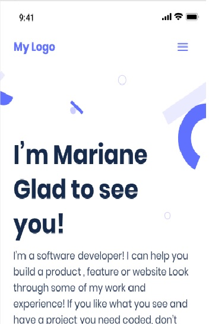

# my-portfolio

This project is focused on building a personal portfolio project.

The goal of this project is to build a simple single page responssive portfolio project where all other personal projects will be kept. In this project, you are expected to setup Html-CSS linter following the guildlines stated in the Html-CSS limter config documentation, follow mobile first approach while building the website, run tests and finally deploy.
The project will contain an about me page, a project page and contact information

## Built With

- HTML5, Javascript
- CSS3
- Linters

## Live Demo

[Live Demo Link](https://victorokoroji.netlify.app/)

To get a local copy up and running follow these simple example steps.

### Prerequisites
- Have a good knowledge on how to use figma
- Have VSCode or other text editor installed. [Link to download VSCode](https://code.visualstudio.com/download)
- Install node package. [Link to download node](https://nodejs.org/en/download/)
- Have git installed.[Link to download git](https://git-scm.com/downloads)
- Create a github repository.

### Setup
- git clone https://github.com/vickymarz/my-portfolio.git
- cd my-portfolio/
-Follow the HTML-CSS linter confuguration to docs to setup linters [Link to Microverse linter docs](https://github.com/microverseinc/linters-config/tree/master/html-css)

## Author

👤 **Okoroji Victor aka Vickymarz**

- GitHub: [@githubhandle](https://github.com/vickymarz)

- LinkedIn: [LinkedIn](https://www.linkedin.com/in/victorebubeokoroji)

## 🤝 Contributing

Contributions, issues, and feature requests are welcome!

Feel free to check the [issues page](../../issues/).

## Show your support

Give a ⭐️ if you like this project!

## Acknowledgments

- Microverse
- Coding Partners

## 📝 License

This project is [MIT](./MIT.md) licensed.
